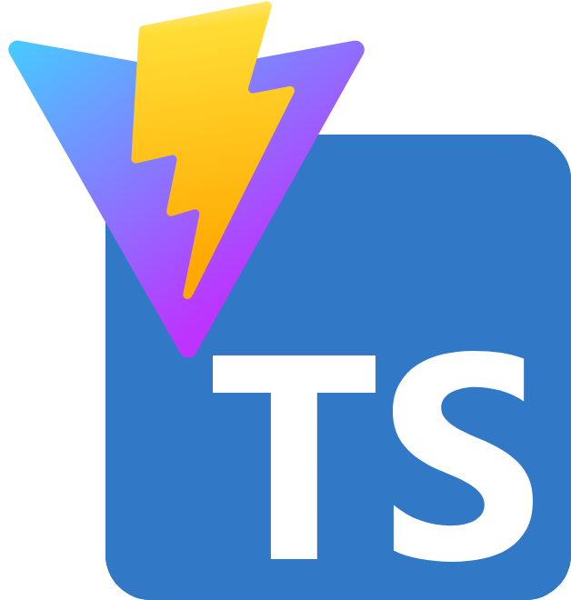

# Learning TypeScript

## Learning Topics

### intro typescript base on
- **Components**  
- **CSS** (styling)  
- **useState** (React state management)  

## 🧪 Testing with Vitest
- **Unit Tests** (testing logic & components)  
- **Component Tests** (rendering, props, events)  
- **Snapshots** (code checks)  
- **Troubleshooting Events** (clicks)  
- **Unit Testing CSS Styles** (checking applied classes & style changes)  